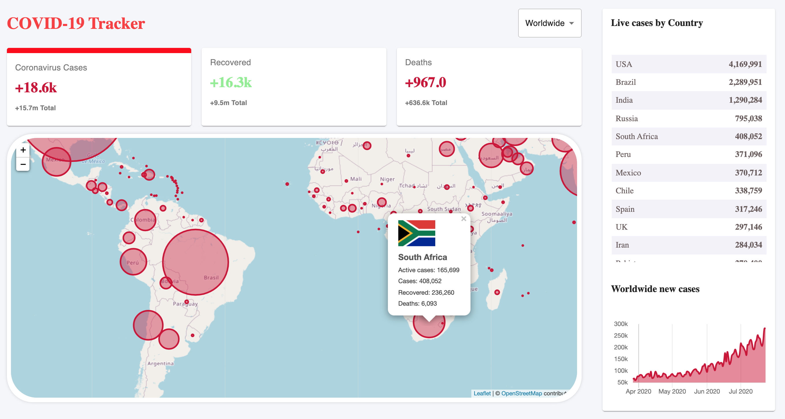

# 

<br/>
  
> COVID19 Tracker. It´s a beautiful app, developed using ReactJS and it´s objective is to showcase the info about the disease throughout the world.

To run the app, you just need to run the commands below.
<br />

```
yarn
yarn start
```

Technologies used

- React JS
- Material UI
- Axios
- disease.sh API to get all the disease info worldwide <https://disease.sh/>
- Firebase Hosting
- React Leaflet Maps: <https://react-leaflet.js.org/>